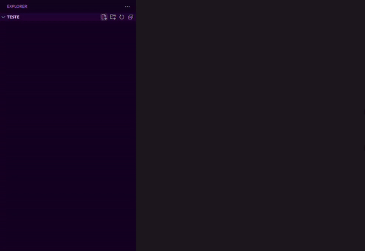

# Vue3init

This extension helps you quickly set up a Vue 3 component with the script setup, template, and style sections.

## Features

- Quickly initialize a Vue 3 component with the correct structure.

## Installation

1. Open VS Code.
2. Go to Extensions.
3. Search for "vue3init".
4. Click Install.

## How to Use

1. Open a `.vue` file.
2. Type `vue3init`.
3. Enjoy your new Vue 3 component!

## Contributing

Feel free to submit issues or pull requests.

## License

[MIT](LICENSE)
